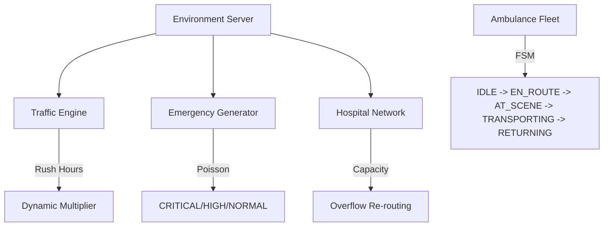

# 🚑 DispatchCommand — Cinematic Ambulance RL Environment

A production-grade, infrastructure-level Reinforcement Learning environment for **city-scale ambulance dispatch optimization**, built for the [OpenEnv](https://openenv.dev) platform (Meta / HuggingFace / PyTorch Hackathon).

This project simulates 108/112 emergency dispatch under life-or-death time pressure, featuring dynamic traffic, hospital overflow risk, and multi-objective triage.

---

## ⚡ Technical Highlights (The "Extraordinary" Submission)

- **Next.js 14 Dashboard**: A high-fidelity, cinematic dark-mode dashboard with real-time WebGL city maps, motion-trailed ambulances, and pulsing incident markers.
- **RFC 004 Rubric Engine**: Implements the official `Rubric` class for 9 named reward components (`DispatchSpeed`, `SeverityBonus`, `TrafficPenalty`, etc.), enabling advanced reward shaping research.
- **RFC 003 MCP Server**: Exposes the environment as a **Model Context Protocol** server at `/mcp`, compatible with Claude, GPT-4, and future autonomous agents.
- **RFC 002 Auto-Discovery**: Full dynamic tool discovery at `GET /tools` using Pydantic JSON schemas.
- **Production Infrastructure**: 
    - `SUPPORTS_CONCURRENT_SESSIONS = True`: Handles 100+ isolated parallel environments.
    - **True Async Implementation**: Dijkstra pathfinding offloaded to `ThreadPoolExecutor` to keep the event loop non-blocking.
    - **Deterministic Seeding**: Byte-identical episode replay across any inference run.

---

## 🏗️ Environment Architecture



---

## 📊 Dashboard & Visualization

The dashboard (built with **Next.js**, **Framer Motion**, and **Chart.js**) provides professional situational awareness:
- **Live Dispatch Queue**: Real-time prioritized incident list with expiration countdowns.
- **Efficiency Radar**: 9-axis radar chart visualizing the agent's performance across all rubric dimensions.
- **WebGL City Map**: Hexagonal hub-and-spoke layout with real-time traffic heatmapping.
- **Trajectory Replay**: API-driven episode playback for deep-dive debugging.

---

## 🛠️ Action Space (RFC 002)

Validated by `ActionModel` with `extra='forbid'` to ensure zero-tolerance validation:

```python
class ActionModel(Action):
    ambulance_id: Optional[int]    # Unit identifier
    emergency_id: str              # UUID of high-priority incident
    hospital_id: Optional[int]     # Target hospital node
    reposition_node: Optional[int]  # Proactive staging node
    is_noop: bool = False           # Forced skip
```

---

## 🏆 Reward Rubric (RFC 004)

| Component | Logic | Value |
|---|---|---|
| `EmergencyServed` | Successful delivery | +20.0 |
| `SeverityBonus` | CRITICAL (+30) / HIGH (+10) | +10 to +30 |
| `DispatchSpeed` | Rapid response delta | up to +10.0 |
| `CapacityViolation` | Routing to full hospital | −5.0 |
| `TimeoutPenalty` | Unserved death/expiration | −15.0 |
| `IdlePenalty` | Units idle during backlog | −1.0/step |

---

## 🚀 Deployment

```bash
# 1. Install & Serve
pip install -r requirements.txt
uvicorn server.app:app --host 0.0.0.0 --port 7860

# 2. Run Inference
python inference.py --task hard
```

**Docker (HF Spaces Compatible):**
```bash
docker build -t ambulance-openenv .
docker run -p 3000:3000 -p 7860:7860 ambulance-openenv
```

---

## 📜 RFC Compliance Table

| RFC | Feature | Status |
|---|---|---|
| 001 | Base Env API | ✅ Implemented |
| 002 | Auto-Discovery | ✅ GET /tools |
| 003 | MCP Protocol | ✅ GET /mcp |
| 004 | Named Rubric | ✅ 9 Components |
| 005 | Concurrency | ✅ Session-Isolated |

---

## Running Tests

```bash
python -m pytest tests/ -v
```

32 tests covering: environment reset/step/state, action validation, grader correctness, edge cases.

---

## Training the DQN Agent

```bash
python train.py
```

The agent uses a **Dueling DQN** with:
- Prioritized Experience Replay (`rl/prioritized_replay_buffer.py`)
- Soft target updates
- Demand prediction via `rl/demand_predictor.py`
- Action masking for invalid dispatches (`rl/action_mask.py`)
- 120-dimensional state encoding (`rl/state_encoder.py`)

---

## Repository Structure

```
env/              # Core simulation (AmbulanceEnv, models, simulator)
rl/               # DQN agent, rubric, state encoder, replay buffers
server/           # OpenEnv HTTP server (FastAPI + WebSocket)
tasks/            # Task configs: easy / medium / hard
agents/           # Baseline, greedy, priority rule-based agents
tests/            # pytest test suite (32 tests)
frontend/         # React 18 + Tailwind live dashboard
inference.py      # Run one episode and emit JSON events
train.py          # Train the DQN agent
evaluate.py       # Evaluate a saved checkpoint
```

## Tasks
The simulation supports three difficulty levels:
- **Easy**: 1 ambulance, no traffic, single emergency focus. Ideal for basic functional testing.
- **Medium**: 3 ambulances, mild traffic variations, 3-5 concurrent emergencies. Tests coordination and prioritization.
- **Hard**: 5 ambulances, high dynamic traffic, and strict hospital capacity constraints. Tests edge-case management under heavy load.

## Agents

### SmartDispatchAgent
A high-performance heuristic agent that prioritizes emergencies by severity and distance. It serves as a robust baseline for evaluation.

### PriorityAgent
An LLM-driven dispatch coordinator that uses structured prompting to make informed allocation decisions. It includes a mission-critical heuristic fallback to ensure 100% availability during API latency or outages.

## Setup

### Installation
```bash
pip install -r requirements.txt
```

### Execution
Run the full evaluation cycle across all task levels:
```bash
python inference.py
```

## Environment Variables
The following variables are used for API integration and LLM agent connectivity:
- `API_BASE_URL`: The endpoint for OpenEnv performance logging.
- `MODEL_NAME`: The identifier for the RL policy.
- `HF_TOKEN`: HuggingFace token for secure model and API access.

## Example Output Logs
The system produces strict JSON telemetry for automated parsing:

```json
{"type": "START", "task": "medium"}
{"type": "STEP", "step": 1, "action": {"ambulance_id": 0, "emergency_id": "a1b2", "hospital_id": 1}, "reward": 8.4, "done": false}
{"type": "END", "task": "medium", "score": 0.82}
```

## Deployment
- **Docker**: Containerize the environment for reliable execution in any infrastructure.
- **HuggingFace**: Deploy as a Space for real-time monitoring and evaluation of public RL policies.

## Future Improvements
- **Real-World Topographies**: Integration of OpenStreetMap data for specific city simulations.
- **Multi-Agent Coordination**: Transitioning from centralized dispatching to decentralized agent cooperation.
- **Deep Reinforcement Learning**: Training Proximal Policy Optimization (PPO) models using the dense reward signals provided.
