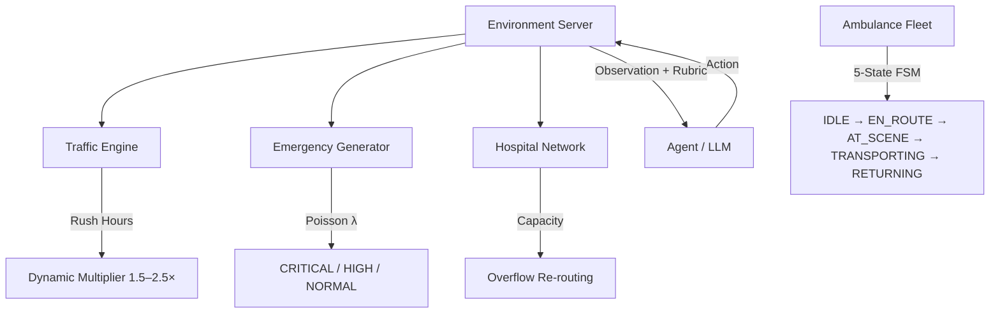

<div align="center">

# 🚑 Ambulance Dispatch — OpenEnv RL Environment

### *City-Scale Emergency Dispatch Optimisation with Reinforcement Learning*

[](https://python.org)
[](https://fastapi.tiangolo.com)
[](https://hub.docker.com)
[](https://openenv.dev)
[](https://opensource.org/licenses/MIT)
[](tests/)
[](https://huggingface.co/spaces/vishallakshmikanthan/Ambulance-OpenENV)

---

**A production-grade reinforcement learning environment for city-scale ambulance dispatch optimisation.**

Built for the **Scaler × Meta × HuggingFace × PyTorch OpenEnv Hackathon**.

Simulates India's 108/112 emergency dispatch system under life-or-death time pressure, featuring dynamic traffic, hospital overflow, specialty routing, and multi-objective triage across a stochastic city graph.

[Live Demo](https://huggingface.co/spaces/vishallakshmikanthan/Ambulance-OpenENV) · [Report Bug](https://github.com/CSNEHA20/Meta_PyTorch_OpenEnv_Hackathon/issues) · [Documentation](#table-of-contents)

</div>

---

## 👥 Team

| Name | Role | GitHub |
|------|------|--------|
| **SNEHA C** | Team Lead | [@CSNEHA20](https://github.com/CSNEHA20) |
| **Vishal Lakshmikanthan** | Member | [@Vishallakshmikanthan](https://github.com/Vishallakshmikanthan) |

---

## 📑 Table of Contents

- [Overview](#-overview)
- [Why Ambulance Dispatch?](#-why-ambulance-dispatch)
- [Key Features](#-key-features)
- [Architecture](#-architecture)
- [Environment Design](#-environment-design)
  - [City Graph](#city-graph)
  - [Ambulance Fleet (FSM)](#ambulance-fleet-fsm)
  - [Emergency Generator](#emergency-generator)
  - [Traffic Engine](#traffic-engine)
  - [Hospital Network](#hospital-network)
- [Action Space](#-action-space)
- [Observation Space](#-observation-space)
- [Reward Rubric (RFC 004)](#-reward-rubric-rfc-004)
- [Tasks & Grading](#-tasks--grading)
  - [Easy Task](#easy-task)
  - [Medium Task](#medium-task)
  - [Hard Task](#hard-task)
- [Agents](#-agents)
- [Inference & Log Format](#-inference--log-format)
- [Baseline Scores](#-baseline-scores)
- [RFC Compliance](#-rfc-compliance)
- [API Endpoints](#-api-endpoints)
- [Dashboard & Visualisation](#-dashboard--visualisation)
- [Getting Started](#-getting-started)
  - [Prerequisites](#prerequisites)
  - [Installation](#installation)
  - [Running Inference](#running-inference)
  - [Running the Server](#running-the-server)
  - [Running Tests](#running-tests)
  - [Docker Deployment](#docker-deployment)
- [DQN Training Pipeline](#-dqn-training-pipeline)
- [Project Structure](#-project-structure)
- [Environment Variables](#-environment-variables)
- [Tech Stack](#-tech-stack)
- [Deployment](#-deployment)
- [Future Improvements](#-future-improvements)
- [License](#-license)

---

## 🌐 Overview

This project implements a fully OpenEnv-compatible reinforcement learning environment where AI agents manage a fleet of ambulances across a procedurally generated city. The agent must dispatch ambulances to incoming emergencies, navigate dynamic traffic, route patients to appropriate hospitals, and balance competing priorities — all under strict time constraints where delays cost lives.

The environment produces a **dense, shaped reward signal** via an RFC 004 Rubric with **9 named components**, enabling fine-grained reward decomposition for training and diagnostic analysis.

---

## 🏥 Why Ambulance Dispatch?

> *In India, over 40 million emergency calls are handled annually by 108/112 dispatch networks. Every 60-second delay in CRITICAL response increases mortality by 10%.*
> — GVK EMRI National Statistics

Ambulance dispatch is a **real-world professional task** performed by trained operators in every country. Optimising it has direct, measurable impact on human lives. This environment models the core decision-making challenge:

- **Which ambulance** should respond? (nearest vs. fastest vs. least busy)
- **Which hospital** should receive the patient? (nearest vs. specialty vs. capacity)
- **When to reposition** idle units? (proactive coverage vs. reactive dispatch)

These decisions must be made under uncertainty (stochastic arrivals), time pressure (emergencies expire), and resource constraints (finite fleet, limited hospital beds).

---

## ✨ Key Features

| Feature | Description |
|---------|-------------|
| 🏙️ **Procedural City** | Barabási-Albert scale-free graph (20 nodes, m=3) — realistic hub-and-spoke topology |
| 🚑 **5-State FSM Fleet** | IDLE → EN_ROUTE → AT_SCENE → TRANSPORTING → RETURNING lifecycle per ambulance |
| 🔴 **3 Severity Tiers** | CRITICAL (expires in 10 steps), HIGH (20 steps), NORMAL (30 steps) |
| 🚦 **Dynamic Traffic** | Rush-hour multipliers (1.5–2.5×) + random road incidents (3.0× blockage) |
| 🏨 **Hospital Network** | Capacity limits, specialty routing (Trauma/Cardiac/General/Paediatric) |
| 📊 **RFC 004 Rubric** | 9 named reward components for per-component training introspection |
| 🔌 **Full RFC Suite** | RFC 001–005 compliant (Base API, Auto-Discovery, MCP, Rubric, Concurrency) |
| 🧪 **58 Tests** | Comprehensive pytest suite covering environment, graders, and models |
| 🖥️ **Next.js Dashboard** | Real-time dark-mode UI with city map, dispatch queue, and reward charts |
| 🐳 **Docker-Ready** | Single-command deployment to HuggingFace Spaces or any container host |
| 🔁 **Deterministic Seeding** | Byte-identical episode replay across any run (seed=42) |

---

## 🏗 Architecture

```
┌─────────────────────────────────────────────────────────────┐
│  inference.py  /  any LLM client  /  RL agent               │
│  POST /env/reset  →  POST /env/step  →  GET /env/state      │
└────────────────────────────┬────────────────────────────────┘
                             │ HTTP / WebSocket
┌────────────────────────────▼────────────────────────────────┐
│  FastAPI Server (server/app.py, port 7860)                   │
│  ├── OpenEnv Core Endpoints   (/env/reset, /env/step)        │
│  ├── RFC 002 Auto-Discovery   (GET /tools)                   │
│  ├── RFC 003 MCP Protocol     (GET /mcp)                     │
│  ├── Episode History          (GET /episodes)                │
│  ├── Session Management       (SUPPORTS_CONCURRENT=True)     │
│  └── WebSocket Live Feed      (/ws/live @ 2 Hz)             │
└────────────────────────────┬────────────────────────────────┘
                             │
┌────────────────────────────▼────────────────────────────────┐
│  AmbulanceEnvironment (env/environment.py)                   │
│  ├── CityGraph         (NetworkX Barabási-Albert, n=20,m=3)  │
│  ├── AmbulanceFleet    (5-state FSM × n_ambulances)          │
│  ├── EmergencyGenerator(Poisson λ arrival, 3 severity tiers) │
│  ├── TrafficEngine     (rush-hour + incident multipliers)    │
│  ├── HospitalNetwork   (capacity + specialty constraints)    │
│  └── Rubric Engine     (RFC 004, 9 named reward components)  │
└─────────────────────────────────────────────────────────────┘
```



---

## 🎮 Environment Design

### City Graph

The city is modelled as a **Barabási-Albert scale-free graph** with 20 nodes and attachment parameter m=3. This produces a realistic hub-and-spoke topology where a few central nodes have high connectivity (major intersections) while peripheral nodes have low degree (suburbs). Edge weights represent travel time and are affected by the traffic engine.

### Ambulance Fleet (FSM)

Each ambulance follows a **5-state finite state machine**:

```
IDLE ──dispatch──▶ EN_ROUTE ──arrive──▶ AT_SCENE ──load──▶ TRANSPORTING ──deliver──▶ RETURNING ──home──▶ IDLE
```

| State | Description | Duration |
|-------|-------------|----------|
| `IDLE` | Available for dispatch at current node | — |
| `EN_ROUTE` | Travelling to emergency scene | Dijkstra shortest path × traffic |
| `AT_SCENE` | Loading patient (1 step) | 1 step |
| `TRANSPORTING` | Travelling to designated hospital | Dijkstra shortest path × traffic |
| `RETURNING` | Returning to base/staging node | Varies |

### Emergency Generator

Emergencies arrive via a **Poisson process** with configurable arrival rate (λ). Each emergency has:
- **Node**: Random graph node where the incident occurs
- **Severity**: CRITICAL (highest urgency, shortest timeout), HIGH, or NORMAL
- **Timeout**: Steps remaining before the emergency expires unserved (CRITICAL=10, HIGH=20, NORMAL=30)

### Traffic Engine

The traffic system has two components:
1. **Rush-hour multiplier**: Global travel-time multiplier that oscillates between 1.0× (off-peak) and 2.5× (peak hours), activated on hard difficulty
2. **Incident events**: Random road blockages that apply a 3.0× multiplier to specific edges for several steps

### Hospital Network

Hospitals have:
- **Fixed capacity**: Maximum concurrent patients (default 8)
- **Specialty** (hard mode): Trauma, Cardiac, General, or Paediatric — routing to the wrong specialty incurs a penalty
- **Overflow protection**: Dispatching to a full hospital triggers a `CapacityViolation` penalty (−5.0)

---

## 🕹️ Action Space

Actions are validated by `ActionModel` with Pydantic `extra='forbid'` for zero-tolerance validation:

```python
class ActionModel(Action):
    ambulance_id: Optional[int]     # ID of the idle ambulance to dispatch (0-indexed)
    emergency_id: str               # UUID of the target unassigned emergency
    hospital_id: Optional[int]      # ID of destination hospital (0-indexed)
    reposition_node: Optional[int]  # Graph node to reposition idle ambulance to (optional)
    is_noop: bool = False           # When true, skip dispatch and advance one step
```

| Field | Type | Required | Description |
|-------|------|----------|-------------|
| `ambulance_id` | `int` | For dispatch | 0-indexed ID of an idle ambulance |
| `emergency_id` | `str` | For dispatch | UUID of an active unassigned emergency |
| `hospital_id` | `int` | For dispatch | 0-indexed ID of destination hospital |
| `reposition_node` | `int` | No | Graph node for proactive ambulance staging |
| `is_noop` | `bool` | No | Skip this step (default: `false`) |

---

## 👁️ Observation Space

Returned by `reset()` and `step()` as `ObservationModel`:

| Field | Type | Description |
|-------|------|-------------|
| `ambulances` | `List[AmbulanceInfo]` | Each unit's node, FSM state, ETA, assigned targets |
| `emergencies` | `List[EmergencyInfo]` | Active unassigned incidents — node, severity, countdown |
| `hospitals` | `List[HospitalInfo]` | Node, capacity, current occupancy, specialty |
| `traffic` | `Dict[str, float]` | `"global"` traffic multiplier (1.0 – 2.5×) |
| `step` | `int` | Current simulation tick |
| `reward` | `float` | Scalar step reward from RFC 004 Rubric |
| `reward_model` | `RewardModel` | Typed reward: scalar + named components + served/missed counts |
| `done` | `bool` | Whether the episode has terminated |
| `rubric` | `Rubric` | Per-component breakdown for training introspection |

### Nested Types

<details>
<summary><b>AmbulanceInfo</b></summary>

| Field | Type | Description |
|-------|------|-------------|
| `id` | `int` | Ambulance identifier |
| `node` | `int` | Current graph node |
| `state` | `AmbulanceState` | FSM state (idle/en_route/at_scene/transporting/returning) |
| `eta` | `int` | Steps until current action completes |
| `target_emg_id` | `str?` | Assigned emergency UUID |
| `target_hosp_id` | `int?` | Assigned hospital ID |

</details>

<details>
<summary><b>EmergencyInfo</b></summary>

| Field | Type | Description |
|-------|------|-------------|
| `id` | `str` | UUID identifier |
| `node` | `int` | Graph node of incident |
| `severity` | `Severity` | CRITICAL / HIGH / NORMAL |
| `time_remaining` | `int` | Steps before expiry |
| `assigned` | `bool` | Whether an ambulance has been dispatched |
| `spawn_time` | `int` | Step when the emergency appeared |

</details>

<details>
<summary><b>HospitalInfo</b></summary>

| Field | Type | Description |
|-------|------|-------------|
| `id` | `int` | Hospital identifier |
| `node` | `int` | Graph node |
| `capacity` | `int` | Maximum concurrent patients |
| `current_patients` | `int` | Current occupancy |
| `specialty` | `str` | Hospital type (General/Trauma/Cardiac/Paediatric) |

</details>

---

## 🏆 Reward Rubric (RFC 004)

The environment computes reward via a **9-component Rubric** for fine-grained training introspection:

| # | Component | Trigger | Value | Purpose |
|---|-----------|---------|-------|---------|
| 1 | `EmergencyServed` | Ambulance arrives at scene | **+20.0** | Reward successful dispatch |
| 2 | `SeverityBonus` | CRITICAL/HIGH served | **+10 to +30** | Prioritise high-acuity cases |
| 3 | `DispatchSpeed` | Rapid response (low wait) | **up to +10.0** | Encourage fast response times |
| 4 | `HospitalDelivery` | Patient delivered to hospital | **+10.0** | Reward completing the care chain |
| 5 | `DistancePenalty` | Long travel distance | **−variable** | Discourage inefficient routing |
| 6 | `TrafficPenalty` | Dispatch during high traffic | **−variable** | Penalise ignoring traffic state |
| 7 | `IdlePenalty` | Ambulance idle during backlog | **−1.0/step** | Penalise underutilisation |
| 8 | `CapacityViolation` | Route to full hospital | **−5.0** | Prevent hospital overflow |
| 9 | `TimeoutPenalty` | Emergency expires unserved | **−15.0** | Penalise missed emergencies |

Additionally, a `fairness_score` component tracks equitable coverage across city zones (used in hard grading).

---

## 📋 Tasks & Grading

Three difficulty levels with distinct configurations and grading formulas:

### Easy Task

| Parameter | Value |
|-----------|-------|
| Ambulances | 2 |
| Hospitals | 2 |
| Hospital Capacity | 8 |
| Arrival Rate (λ) | 0.3 |
| Max Steps | 30 |
| Severity Levels | NORMAL only |
| Traffic | Disabled |
| Seed | 42 |

**Grading Formula:**
```
For each served emergency:
    ratio = optimal_response_time / actual_response_time

score = mean(ratios), clamped to [0.0, 1.0]
```
> Tests basic dispatch correctness. Dispatch immediately + pick nearest hospital.

---

### Medium Task

| Parameter | Value |
|-----------|-------|
| Ambulances | 4 |
| Hospitals | 3 |
| Hospital Capacity | 8 |
| Arrival Rate (λ) | 0.4 |
| Max Steps | 60 |
| Severity Levels | All (CRITICAL, HIGH, NORMAL) |
| Traffic | Mild (1.0–1.3× multiplier) |
| Seed | 42 |

**Grading Formula:**
```
served_percentage = served / total_emergencies
response_score    = max(0.0, 1.0 - avg_response_time / 15.0)
idle_fraction     = idle_steps / total_steps

score = 0.50 × served_percentage
      + 0.35 × response_score
      - 0.15 × idle_fraction

Clamped to [0.0, 1.0]
```
> Tests fleet coordination, priority dispatch (CRITICAL first), and hospital load balancing.

---

### Hard Task

| Parameter | Value |
|-----------|-------|
| Ambulances | 6 |
| Hospitals | 4 (Trauma / Cardiac / General / Paediatric) |
| Hospital Capacity | 8 |
| Arrival Rate (λ) | 0.6 |
| Max Steps | 100 |
| Severity Levels | All (CRITICAL, HIGH, NORMAL) |
| Traffic | Dynamic (rush-hour 1.5–2.5× + incidents 3.0×) |
| Specialties | Enabled |
| Seed | 42 |

**Grading Formula:**
```
critical_rate   = critical_served / critical_total
overall_rate    = served / total_emergencies
weighted_served = 0.7 × critical_rate + 0.3 × overall_rate

priority_accuracy = priority_correct / priority_total
fairness_score    = 1 - normalised_std_dev(zone_service_rates)
overload_penalty  = 0.05 × capacity_violations

score = 0.50 × weighted_served
      + 0.30 × priority_accuracy
      + 0.15 × fairness_score
      - overload_penalty

Clamped to [0.0, 1.0]
```
> Tests CRITICAL-first dispatch, specialty routing, zone fairness, and traffic-aware planning.

---

## 🤖 Agents

### Greedy Priority Agent (`agents/greedy_agent.py`)
A rule-based agent that prioritises emergencies by severity and dispatches the nearest idle ambulance. Serves as the default baseline — no LLM required.

### Priority Agent (`agents/priority_agent.py`)
An LLM-driven dispatch coordinator using structured prompting via the OpenAI-compatible API. Includes a heuristic fallback for 100% availability during API latency or outages.

### Oracle Agent (`agents/oracle.py`)
A Dijkstra-based optimal dispatcher that computes globally optimal assignments. Used as an upper-bound reference for evaluating other agents.

### Baseline Agent (`agents/baseline.py`)
A minimal agent for testing that dispatches the first available ambulance to the first emergency.

---

## 📝 Inference & Log Format

The inference script (`inference.py`) produces strict `[START]` / `[STEP]` / `[END]` telemetry for automated evaluation:

```
[START] task=easy env=ambulance-dispatch model=Qwen/Qwen2.5-72B-Instruct
[STEP] step=1 action=dispatch(amb=0,emg='abc-123',hosp=0) reward=18.50 done=false error=null
[STEP] step=2 action=noop() reward=-0.50 done=false error=null
...
[END] success=true steps=30 score=0.90 rewards=18.50,-0.50,...
```

Run inference:
```bash
python inference.py              # All three tasks
python inference.py --task easy  # Single task
```

---

## 📊 Baseline Scores

Measured with the built-in **greedy priority agent** (no LLM, no training) on seed=42:

| Task | Ambulances | Steps | Score | Key Challenge |
|------|-----------|-------|-------|---------------|
| **Easy** | 2 | 30 | **0.90** | Basic dispatch correctness |
| **Medium** | 4 | 60 | **0.18** | Fleet coordination under mild traffic |
| **Hard** | 6 | 100 | **0.62** | CRITICAL triage + specialty routing + fairness |

> Scores are **deterministic and reproducible** — all RNG seeded with `seed=42`. Running `python inference.py` twice produces identical output.

---

## 📜 RFC Compliance

| RFC | Feature | Endpoint | Status |
|-----|---------|----------|--------|
| 001 | Base Env API | `/env/reset`, `/env/step`, `/env/state` | ✅ Implemented |
| 002 | Auto-Discovery | `GET /tools` | ✅ Pydantic JSON Schemas |
| 003 | MCP Protocol | `GET /mcp` | ✅ Model Context Protocol |
| 004 | Named Rubric | 9 components in every observation | ✅ Full Rubric |
| 005 | Concurrent Sessions | `SUPPORTS_CONCURRENT_SESSIONS = True` | ✅ Session-Isolated |

---

## 🔌 API Endpoints

| Method | Path | Description |
|--------|------|-------------|
| `GET` | `/health` | Health check — returns `{"status": "ok"}` |
| `POST` | `/env/reset` | Reset environment, returns initial observation |
| `POST` | `/env/step` | Submit action, returns next observation |
| `GET` | `/env/state` | Get current environment state |
| `GET` | `/tools` | RFC 002 — auto-discovery with JSON schemas |
| `GET` | `/mcp` | RFC 003 — Model Context Protocol metadata |
| `GET` | `/episodes` | List completed episode history |
| `WS` | `/ws/live` | WebSocket — real-time state updates at 2 Hz |

---

## 📺 Dashboard & Visualisation

A real-time **Next.js 14** dashboard with dark-mode UI:

- **Live City Map** — Hexagonal hub-and-spoke layout with ambulance positions and emergency markers
- **Dispatch Queue** — Prioritised incident list with severity badges and expiration countdowns
- **Reward Chart** — Realtime reward trajectory with per-component breakdown
- **Ambulance Table** — Fleet status with FSM state, ETA, and assignment details
- **Hospital Panel** — Capacity bars and specialty labels per hospital

Built with **Tailwind CSS**, **Chart.js**, and optimised for a cinematic situational-awareness experience.

---

## 🚀 Getting Started

### Prerequisites

- **Python 3.11+**
- **Node.js 18+** (for the Next.js dashboard, optional)
- **Docker** (for containerised deployment, optional)

### Installation

```bash
# 1. Clone the repository
git clone https://github.com/CSNEHA20/Meta_PyTorch_OpenEnv_Hackathon.git
cd Meta_PyTorch_OpenEnv_Hackathon

# 2. Create and activate virtual environment
python -m venv .venv
source .venv/bin/activate  # Windows: .venv\Scripts\activate

# 3. Install Python dependencies
pip install -r requirements.txt

# 4. Copy the example env file and add your API credentials
cp .env.example .env
# Edit .env and set HF_TOKEN, API_BASE_URL, MODEL_NAME
```

### Running Inference

```bash
# Run all three tasks (emits [START]/[STEP]/[END] logs to stdout)
python inference.py

# Run a specific task
python inference.py --task easy
python inference.py --task medium
python inference.py --task hard
```

### Running the Server

```bash
# Development (with hot-reload)
uvicorn server.app:app --host 0.0.0.0 --port 7860 --reload

# Production (4 workers)
uvicorn server.app:app --host 0.0.0.0 --port 7860 --workers 4
```

Then open `http://localhost:7860/health` for health check.

### Running Tests

```bash
python -m pytest tests/ -v
```

All **58 tests** cover environment reset/step/state logic, all three graders, model validation, and edge cases.

### Docker Deployment

```bash
# Build the image
docker build -t ambulance-openenv .

# Run the container
docker run -p 7860:7860 \
  -e HF_TOKEN=your_hf_token_here \
  -e API_BASE_URL=https://router.huggingface.co/v1 \
  -e MODEL_NAME=Qwen/Qwen2.5-72B-Instruct \
  ambulance-openenv
```

---

## 🧠 DQN Training Pipeline

The project includes a full **Dueling DQN** training infrastructure in `rl/`:

| Module | Purpose |
|--------|---------|
| `rl/dqn.py` | Dueling DQN network architecture |
| `rl/rl_agent.py` | Training loop with soft target updates |
| `rl/prioritized_replay_buffer.py` | Prioritised Experience Replay (PER) |
| `rl/replay_buffer.py` | Standard replay buffer |
| `rl/state_encoder.py` | 120-dimensional state encoding |
| `rl/action_mask.py` | Masks invalid actions (dispatching busy ambulances) |
| `rl/action_mapper.py` | Maps discrete DQN outputs to environment actions |
| `rl/demand_predictor.py` | Predicts future emergency arrivals for proactive staging |
| `rl/rubric.py` | RFC 004 Rubric integration for reward shaping |

```bash
# Train the DQN agent
python train.py

# Evaluate a saved checkpoint
python evaluate.py
```

---

## 📁 Project Structure

```
📦 Ambulance-OpenENV
├── 📄 inference.py              # Baseline inference — [START]/[STEP]/[END] logs
├── 📄 openenv.yaml              # OpenEnv specification metadata
├── 📄 Dockerfile                # Docker build (port 7860, 4 workers)
├── 📄 pyproject.toml            # Project config, dependencies, scripts
├── 📄 requirements.txt          # Pip dependencies
├── 📄 train.py                  # DQN training script
├── 📄 evaluate.py               # Checkpoint evaluation
├── 📄 demo.py                   # Interactive demo runner
├── 📄 compare.py                # Agent comparison benchmarks
├── 📄 verify_sim.py             # Simulation verification
│
├── 📂 env/                      # Core simulation engine
│   ├── environment.py           #   AmbulanceEnvironment (main env class)
│   ├── models.py                #   Pydantic models (Action, Observation, Rubric)
│   └── simulator.py             #   Low-level simulation mechanics
│
├── 📂 server/                   # FastAPI server (REST + WebSocket)
│   ├── app.py                   #   Server entry point (port 7860)
│   └── ambulance_environment.py #   OpenEnv environment adapter
│
├── 📂 tasks/                    # Task configurations
│   ├── easy.py                  #   2 ambulances, 30 steps, λ=0.3
│   ├── medium.py                #   4 ambulances, 60 steps, λ=0.4
│   └── hard.py                  #   6 ambulances, 100 steps, λ=0.6
│
├── 📂 agents/                   # Dispatch agents
│   ├── baseline.py              #   Minimal baseline agent
│   ├── greedy_agent.py          #   Rule-based greedy dispatcher
│   ├── priority_agent.py        #   LLM-powered priority agent
│   └── oracle.py                #   Dijkstra-based optimal oracle
│
├── 📂 rl/                       # RL training infrastructure
│   ├── dqn.py                   #   Dueling DQN network
│   ├── rl_agent.py              #   Training loop
│   ├── state_encoder.py         #   120-dim state encoding
│   ├── action_mapper.py         #   Discrete → env action mapping
│   ├── action_mask.py           #   Invalid action masking
│   ├── replay_buffer.py         #   Standard replay buffer
│   ├── prioritized_replay_buffer.py # PER buffer
│   ├── demand_predictor.py      #   Demand forecasting
│   └── rubric.py                #   RFC 004 rubric integration
│
├── 📂 grader_easy.py            # Easy grading formula (optimal/actual ratios)
├── 📂 grader_medium.py          # Medium grading formula (served+response−idle)
├── 📂 grader_hard.py            # Hard grading formula (critical+priority+fairness)
│
├── 📂 tests/                    # pytest test suite (58 tests)
│   ├── test_environment.py      #   Environment logic tests
│   ├── test_graders.py          #   Grader correctness tests
│   └── test_models.py           #   Pydantic model validation tests
│
├── 📂 frontend/                 # Next.js 14 dashboard
│   ├── app/
│   │   ├── page.js              #   Main dashboard page
│   │   ├── layout.js            #   Root layout
│   │   └── components/
│   │       ├── CityMap.jsx      #   Real-time city visualisation
│   │       ├── AmbulanceTable.jsx  # Fleet status table
│   │       ├── HospitalPanel.jsx   # Hospital capacity panel
│   │       └── RewardChart.jsx     # Reward trajectory chart
│   └── tailwind.config.js
│
└── 📂 utils/
    └── logger.py                # Structured logging utilities
```

---

## 🔐 Environment Variables

| Variable | Required | Default | Description |
|----------|----------|---------|-------------|
| `HF_TOKEN` | **Yes** | — | HuggingFace API token for LLM inference |
| `API_BASE_URL` | No | `https://router.huggingface.co/v1` | OpenAI-compatible API endpoint |
| `MODEL_NAME` | No | `Qwen/Qwen2.5-72B-Instruct` | LLM model identifier |

> **Note:** Never commit your `.env` file or tokens to version control. Use `.env.example` as a template.

---

## 🛠 Tech Stack

| Layer | Technology |
|-------|-----------|
| **Language** | Python 3.11 |
| **Framework** | FastAPI + Uvicorn |
| **Env Standard** | OpenEnv (`openenv-core >= 0.2.0`) |
| **Graph Engine** | NetworkX (Barabási-Albert) |
| **Numerics** | NumPy (deterministic `default_rng`) |
| **Validation** | Pydantic v2 (`extra='forbid'`) |
| **LLM Client** | OpenAI Python SDK |
| **RL Framework** | PyTorch (Dueling DQN) |
| **Frontend** | Next.js 14 + Tailwind CSS + Chart.js |
| **Testing** | pytest + pytest-asyncio + httpx |
| **Container** | Docker (`python:3.11-slim`) |
| **Deployment** | HuggingFace Spaces (Docker SDK) |

---

## ☁️ Deployment

### HuggingFace Spaces

The environment is deployed as a Docker-based HuggingFace Space:

🔗 **Live:** [huggingface.co/spaces/vishallakshmikanthan/Ambulance-OpenENV](https://huggingface.co/spaces/vishallakshmikanthan/Ambulance-OpenENV)

The Space is tagged with `openenv` for automatic discovery by the hackathon evaluator.

### GitHub Repositories

| Repository | Link |
|-----------|------|
| **Team Repository** | [github.com/CSNEHA20/Meta_PyTorch_OpenEnv_Hackathon](https://github.com/CSNEHA20/Meta_PyTorch_OpenEnv_Hackathon) |
| **Mirror** | [github.com/Vishallakshmikanthan/Ambulance-Despatch-RL-Model](https://github.com/Vishallakshmikanthan/Ambulance-Despatch-RL-Model) |

---

## 🔮 Future Improvements

- **Real-World Topographies** — Integration of OpenStreetMap data for city-specific simulations
- **Multi-Agent Coordination** — Decentralised agent cooperation instead of centralised dispatch
- **PPO Training** — Proximal Policy Optimisation using the dense RFC 004 reward signal
- **Transfer Learning** — Pre-train on easy, fine-tune on hard for faster convergence
- **Live A/B Testing** — Compare RL agent vs. greedy baseline in real-time via the dashboard

---

## 📄 License

This project is licensed under the **MIT License** — see the [LICENSE](LICENSE) file for details.

---

<div align="center">

**Built with ❤️ for the Scaler × Meta × HuggingFace × PyTorch OpenEnv Hackathon**

*Saving lives, one dispatch at a time.*

</div>