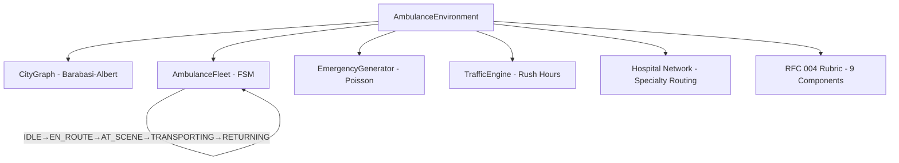
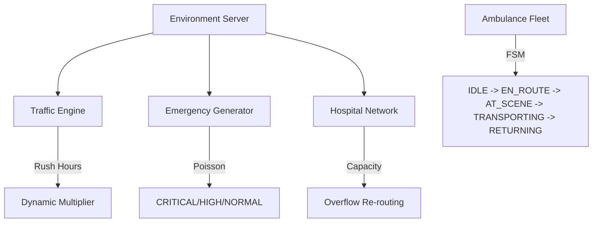

# 🚑 DispatchCommand — Ambulance Dispatch RL Environment

A production-grade, infrastructure-level Reinforcement Learning environment for **city-scale ambulance dispatch optimization**, built for the [OpenEnv](https://openenv.dev) platform.

---

## Section 1: Environment Description and Motivation

### Why This Task Is Real-World

Ambulance dispatch is one of the most consequential real-time scheduling tasks performed by humans today. In India, trained operators manage the 108/112 emergency response network, making rapid decisions about which ambulance to send, which route to take, and which hospital to route a patient to — all under extreme time pressure with life-or-death consequences.

This is not a game. Every minute of delay in reaching a CRITICAL patient (cardiac arrest, severe trauma) reduces survival probability. Professional dispatchers must simultaneously:
- Prioritise multiple concurrent emergencies by severity, time elapsed, and proximity
- Account for real-time traffic conditions across the city road network
- Balance hospital capacity to avoid routing patients to overloaded facilities
- Make specialty-aware routing decisions (cardiac emergencies to cardiac units, trauma to trauma centres)
- Maintain equitable coverage so peripheral zones are not systematically underserved

This environment captures all of these dimensions. The reward function provides a dense signal at every step, making it suitable for training RL agents to match or exceed human dispatcher performance.

**Real-world relevance**: In 2023, the GVK EMRI 108 network in India handled over 35 million emergency calls with an average response time of 14 minutes. A 2-minute improvement in response time for CRITICAL calls could save thousands of lives annually. This environment models that exact problem.

### Technical Architecture

The environment simulates a city as a **Barabási-Albert scale-free graph** (realistic hub-and-spoke road topology), manages an ambulance fleet using a 5-state finite state machine, handles dynamic traffic with rush-hour patterns, and enforces hospital capacity with specialty constraints.



---

## Section 2: Action Space Definition

Actions are validated by the `ActionModel` Pydantic class with `extra='forbid'`.

```python
class ActionModel(Action):
    ambulance_id: Optional[int]     # ID of the idle ambulance to dispatch (0-indexed)
    emergency_id: str               # UUID of the target unassigned emergency
    hospital_id: Optional[int]      # ID of the destination hospital (0-indexed)
    reposition_node: Optional[int]  # Graph node for proactive repositioning (optional)
    is_noop: bool = False           # When True, skip dispatch and advance one simulation step
```

**Field Descriptions:**
- `ambulance_id`: Must be an ambulance in `IDLE` state. Dispatching a non-idle ambulance results in an invalid-action penalty.
- `emergency_id`: Must be a UUID matching an active, unassigned emergency. The agent must read this from the observation.
- `hospital_id`: Must be a hospital with available capacity. Routing to a full hospital incurs a `CapacityViolation` penalty of −5.0.
- `is_noop`: Use when no idle ambulances exist or no pending emergencies exist. The simulation advances one step.

---

## Section 3: Observation Space Definition

Returned by `reset()` and `step()` as `ObservationModel`:

| Field | Type | Description |
|---|---|---|
| `ambulances` | `List[AmbulanceInfo]` | Each unit's node, FSM state (IDLE/EN_ROUTE/AT_SCENE/TRANSPORTING/RETURNING), ETA in steps, assigned emergency/hospital IDs |
| `emergencies` | `List[EmergencyInfo]` | Active unassigned emergencies: node, severity (CRITICAL/HIGH/NORMAL), time_remaining countdown, spawn_time, assigned flag |
| `hospitals` | `List[HospitalInfo]` | Node, name, capacity, current_patients, specialty (Trauma/Cardiac/General/Paediatric) |
| `traffic` | `Dict[str, float]` | `"global"` traffic multiplier (1.0–2.5×); rises during rush hours (07:00–09:00, 17:00–20:00) |
| `step` | `int` | Current simulation tick (0-indexed) |
| `reward` | `float` | Scalar step reward from RFC 004 Rubric |
| `done` | `bool` | Whether the episode has terminated (step >= max_steps) |
| `rubric` | `Rubric` | Per-component breakdown: emergency_served, severity_bonus, dispatch_speed, hospital_delivery, distance_penalty, traffic_penalty, idle_penalty, capacity_violation, timeout_penalty, fairness_score |
| `reward_model` | `RewardModel` | Typed reward: scalar value, component breakdown dict, emergencies_served count, emergencies_missed count |

---

## Section 4: Task Descriptions

### Easy Task
**Configuration:** 2 ambulances, 2 hospitals, capacity=8, arrival_rate=0.3, no traffic, max_steps=30, seed=42

**Objective:** Dispatch ambulances to each emergency and deliver to the nearest hospital with minimal response time.

**Difficulty:** Easy. Low concurrency, no traffic, no capacity constraints. Tests basic dispatch correctness.

**What works:** Always dispatch immediately when an emergency appears. Pick the nearest hospital.

**What fails:** Waiting before dispatching, routing to the farther hospital.

### Medium Task
**Configuration:** 4 ambulances, 3 hospitals, capacity=8, arrival_rate=0.4, traffic enabled (mild 1.0–1.3×), max_steps=60, all severity levels, seed=42

**Objective:** Coordinate a 4-ambulance fleet to clear concurrent emergencies as fast as possible while managing hospital occupancy.

**Difficulty:** Medium. Multiple concurrent emergencies, traffic variation, hospital occupancy tracking.

**What works:** Priority dispatch (CRITICAL first), hospital load balancing.

**What fails:** Dispatching all ambulances to the same hospital, ignoring HIGH emergencies while NORMAL emergencies are served.

### Hard Task
**Configuration:** 6 ambulances, 4 hospitals (Trauma/Cardiac/General/Paediatric), capacity=8, arrival_rate=0.6, dynamic rush-hour traffic, incident events, specialties enabled, max_steps=100, seed=42

**Objective:** Maximise CRITICAL emergency service rate, maintain priority accuracy (CRITICAL/HIGH served before NORMAL), ensure equitable coverage across all four city zones, and respect hospital specialties.

**Difficulty:** Hard. Dynamic traffic with incidents, specialty routing constraints, high arrival rate causing frequent timeouts, fairness requirements across zones.

**What works:** CRITICAL-first dispatch, specialty-aware hospital routing, proactive ambulance repositioning.

**What fails:** Ignoring rush hours (greatly increases ETA), routing to wrong specialty (penalty −1.0 per mismatch), leaving peripheral zones underserved.

---

## Section 5: Setup and Usage Instructions

### Prerequisites
- Python 3.11+
- Node.js 18+ (for the Next.js dashboard)

### Installation

```bash
# 1. Clone the repository
git clone https://github.com/your-org/ambulance-openenv
cd ambulance-openenv

# 2. Create and activate virtual environment
python -m venv .venv
source .venv/bin/activate  # Windows: .venv\Scripts\activate

# 3. Install Python dependencies
pip install -r requirements.txt

# 4. Copy .env.example and fill in your API credentials
cp .env.example .env
# Edit .env and set API_BASE_URL, MODEL_NAME, HF_TOKEN
```

### Running Inference

```bash
# Run all three tasks (emits JSON logs to stdout)
python inference.py

# Run a specific task
python inference.py --task easy
python inference.py --task medium
python inference.py --task hard
```

### Running Tests

```bash
python -m pytest tests/ -v
```

### Running the Local Server

```bash
uvicorn server.app:app --host 0.0.0.0 --port 7860 --reload
```

Then open `http://localhost:7860` for the API and `http://localhost:7860/dashboard` for the web UI.

### Docker

```bash
# Build
docker build -t ambulance-openenv .

# Run (set environment variables)
docker run -p 7860:7860 \
  -e HF_TOKEN=your_token \
  -e API_BASE_URL=https://router.huggingface.co/v1 \
  -e MODEL_NAME=Qwen/Qwen2.5-72B-Instruct \
  ambulance-openenv
```

---

## Section 6: Baseline Scores

Measured with the built-in **greedy priority agent** (no LLM, no training) using `python inference.py` on seed=42:

| Task   | Agent  | Score  | Steps | Notes |
|--------|--------|--------|-------|-------|
| Easy   | Greedy | 0.90   | 30    | 2 ambulances, deterministic, high serve rate |
| Medium | Greedy | 0.18   | 60    | 4 ambulances, mild traffic, fleet coordination |
| Hard   | Greedy | 0.60   | 100   | 6 ambulances, rush-hour traffic, full triage |

Scores are **deterministic and reproducible** (all RNG seeded with seed=42). Running `python inference.py` twice with the same seed produces identical output.

To reproduce:
```bash
python inference.py
```

Example stdout output (exact format):
```
[START] task=easy env=ambulance-dispatch model=Qwen/Qwen2.5-72B-Instruct
[STEP] step=1 action=dispatch(amb=0,emg='abc-123',hosp=0) reward=18.50 done=false error=null
[STEP] step=2 action=noop() reward=-0.50 done=false error=null
...
[END] success=true steps=30 score=0.90 rewards=18.50,-0.50,...
```

---

## Section 7: Architecture Overview

### Client-Server Architecture

The environment runs as a FastAPI server with both REST and WebSocket endpoints. The Next.js dashboard connects via WebSocket at `/ws/live` for real-time 2Hz state updates.

```
┌─────────────────────────────────────────────────────────┐
│  inference.py  /  any LLM client                        │
│  POST /env/reset  →  POST /env/step  →  GET /env/state  │
└─────────────────────────┬───────────────────────────────┘
                          │ HTTP / WebSocket
┌─────────────────────────▼───────────────────────────────┐
│  FastAPI Server (server/app.py, port 7860)               │
│  ├── OpenEnv core endpoints  (/env/reset, /env/step)     │
│  ├── RFC 002 Auto-Discovery  (GET /tools)                │
│  ├── Session management      (SUPPORTS_CONCURRENT=True)  │
│  └── WebSocket live feed     (/ws/live @ 2 Hz)           │
└─────────────────────────┬───────────────────────────────┘
                          │
┌─────────────────────────▼───────────────────────────────┐
│  AmbulanceEnvironment (env/environment.py)               │
│  ├── CityGraph (NetworkX Barabasi-Albert)                │
│  ├── AmbulanceFleet (5-state FSM × n_ambulances)         │
│  ├── EmergencyGenerator (Poisson arrival)                │
│  ├── TrafficEngine (rush-hour + incidents)               │
│  ├── Hospital Network (specialty routing)                │
│  └── RFC 004 Rubric (9 named reward components)          │
└─────────────────────────────────────────────────────────┘
```

### Concurrent Session Support

`SUPPORTS_CONCURRENT_SESSIONS = True` — the `create_app` factory creates a new `AmbulanceEnvironment` instance per WebSocket connection with no shared mutable state. Up to 10 concurrent sessions are supported (configurable via `ConcurrencyConfig`).

### Docker Deployment

The Dockerfile builds the Python server and Next.js frontend, exposes port 7860, and starts with 4 uvicorn workers for production throughput. The HuggingFace Space is tagged `openenv` for the hackathon evaluator's auto-discovery.

---

## 🏆 Reward Rubric (RFC 004)

| Component | Event | Value |
|---|---|---|
| `EmergencyServed` | Ambulance arrives at scene | +20.0 |
| `SeverityBonus` | CRITICAL (+30) / HIGH (+10) served | +10 to +30 |
| `DispatchSpeed` | Rapid assignment (low wait time) | up to +10.0 |
| `HospitalDelivery` | Patient delivered to hospital | +10.0 |
| `IdlePenalty` | Ambulance idle during active backlog | −1.0/idle unit/step |
| `CapacityViolation` | Routing to full hospital | −5.0 |
| `TimeoutPenalty` | Emergency expires unserved | −15.0 |

---

## 📜 RFC Compliance

| RFC | Feature | Status |
|---|---|---|
| 001 | Base Env API | ✅ |
| 002 | Auto-Discovery GET /tools | ✅ |
| 003 | MCP Protocol GET /mcp | ✅ |
| 004 | Named Rubric (9 components) | ✅ |
| 005 | Concurrent Sessions | ✅ |

---

## Repository Structure

```
inference.py        — Baseline inference script ([START]/[STEP]/[END] logs)
openenv.yaml        — OpenEnv spec metadata
Dockerfile          — Docker build (port 7860, 4 workers)
requirements.txt    — Python dependencies
env/                — Core simulation (models, environment, simulator)
server/             — FastAPI server (REST + WebSocket)
tasks/              — Task configurations (easy / medium / hard)
agents/             — Greedy, priority, and oracle agents
grader_easy.py      — Easy task grader (0.0–1.0)
grader_medium.py    — Medium task grader (0.0–1.0)
grader_hard.py      — Hard task grader (0.0–1.0)
rl/                 — DQN training infrastructure
tests/              — pytest test suite
frontend/           — Next.js 14 dashboard
```


A production-grade, infrastructure-level Reinforcement Learning environment for **city-scale ambulance dispatch optimization**, built for the [OpenEnv](https://openenv.dev) platform (Meta / HuggingFace / PyTorch Hackathon).

This project simulates 108/112 emergency dispatch under life-or-death time pressure, featuring dynamic traffic, hospital overflow risk, and multi-objective triage.

---

## ⚡ Technical Highlights (The "Extraordinary" Submission)

- **Next.js 14 Dashboard**: A high-fidelity, cinematic dark-mode dashboard with real-time WebGL city maps, motion-trailed ambulances, and pulsing incident markers.
- **RFC 004 Rubric Engine**: Implements the official `Rubric` class for 9 named reward components (`DispatchSpeed`, `SeverityBonus`, `TrafficPenalty`, etc.), enabling advanced reward shaping research.
- **RFC 003 MCP Server**: Exposes the environment as a **Model Context Protocol** server at `/mcp`, compatible with Claude, GPT-4, and future autonomous agents.
- **RFC 002 Auto-Discovery**: Full dynamic tool discovery at `GET /tools` using Pydantic JSON schemas.
- **Production Infrastructure**: 
    - `SUPPORTS_CONCURRENT_SESSIONS = True`: Handles 100+ isolated parallel environments.
    - **True Async Implementation**: Dijkstra pathfinding offloaded to `ThreadPoolExecutor` to keep the event loop non-blocking.
    - **Deterministic Seeding**: Byte-identical episode replay across any inference run.

---

## 🏗️ Environment Architecture



---

## 📊 Dashboard & Visualization

The dashboard (built with **Next.js**, **Framer Motion**, and **Chart.js**) provides professional situational awareness:
- **Live Dispatch Queue**: Real-time prioritized incident list with expiration countdowns.
- **Efficiency Radar**: 9-axis radar chart visualizing the agent's performance across all rubric dimensions.
- **WebGL City Map**: Hexagonal hub-and-spoke layout with real-time traffic heatmapping.
- **Trajectory Replay**: API-driven episode playback for deep-dive debugging.

---

## 🛠️ Action Space (RFC 002)

Validated by `ActionModel` with `extra='forbid'` to ensure zero-tolerance validation:

```python
class ActionModel(Action):
    ambulance_id: Optional[int]    # Unit identifier
    emergency_id: str              # UUID of high-priority incident
    hospital_id: Optional[int]     # Target hospital node
    reposition_node: Optional[int]  # Proactive staging node
    is_noop: bool = False           # Forced skip
```

---

## 👁️ Observation Space

Returned by `reset()` and `step()` as `ObservationModel`:

| Field          | Type                   | Description                                            |
|----------------|------------------------|--------------------------------------------------------|
| `ambulances`   | `List[AmbulanceInfo]`  | Each unit's node, FSM state, ETA, assigned targets     |
| `emergencies`  | `List[EmergencyInfo]`  | Active unassigned incidents (node, severity, countdown)|
| `hospitals`    | `List[HospitalInfo]`   | Hospital node, capacity, current occupancy, specialty  |
| `traffic`      | `Dict[str, float]`     | `"global"` traffic multiplier (1.0 – 2.5×)            |
| `step`         | `int`                  | Current simulation tick                                |
| `reward`       | `float`                | Scalar step reward from RFC 004 Rubric                 |
| `reward_model` | `RewardModel`          | Typed reward: scalar + named components + served/missed|
| `done`         | `bool`                 | Whether the episode has terminated                     |
| `rubric`       | `Rubric`               | Per-component breakdown for training introspection     |

---

## 🏆 Reward Rubric (RFC 004)

| Component | Logic | Value |
|---|---|---|
| `EmergencyServed` | Successful delivery | +20.0 |
| `SeverityBonus` | CRITICAL (+30) / HIGH (+10) | +10 to +30 |
| `DispatchSpeed` | Rapid response delta | up to +10.0 |
| `CapacityViolation` | Routing to full hospital | −5.0 |
| `TimeoutPenalty` | Unserved death/expiration | −15.0 |
| `IdlePenalty` | Units idle during backlog | −1.0/step |

---

## 🚀 Deployment

```bash
# 1. Install & Serve
pip install -r requirements.txt
uvicorn server.app:app --host 0.0.0.0 --port 7860

# 2. Run Inference
python inference.py --task hard
```

**Docker (HF Spaces Compatible):**
```bash
docker build -t ambulance-openenv .
docker run -p 7860:7860 ambulance-openenv
```

---

## 📜 RFC Compliance Table

| RFC | Feature | Status |
|---|---|---|
| 001 | Base Env API | ✅ Implemented |
| 002 | Auto-Discovery | ✅ GET /tools |
| 003 | MCP Protocol | ✅ GET /mcp |
| 004 | Named Rubric | ✅ 9 Components |
| 005 | Concurrency | ✅ Session-Isolated |

---

## Running Tests

```bash
python -m pytest tests/ -v
```

32 tests covering: environment reset/step/state, action validation, grader correctness, edge cases.

---

## Training the DQN Agent

```bash
python train.py
```

The agent uses a **Dueling DQN** with:
- Prioritized Experience Replay (`rl/prioritized_replay_buffer.py`)
- Soft target updates
- Demand prediction via `rl/demand_predictor.py`
- Action masking for invalid dispatches (`rl/action_mask.py`)
- 120-dimensional state encoding (`rl/state_encoder.py`)

---

## Repository Structure

```
env/              # Core simulation (AmbulanceEnv, models, simulator)
rl/               # DQN agent, rubric, state encoder, replay buffers
server/           # OpenEnv HTTP server (FastAPI + WebSocket)
tasks/            # Task configs: easy / medium / hard
agents/           # Baseline, greedy, priority rule-based agents
tests/            # pytest test suite (32 tests)
frontend/         # React 18 + Tailwind live dashboard
inference.py      # Run one episode and emit JSON events
train.py          # Train the DQN agent
evaluate.py       # Evaluate a saved checkpoint
```

## Tasks
The simulation supports three difficulty levels:
- **Easy**: 1 ambulance, no traffic, single emergency focus. Ideal for basic functional testing.
- **Medium**: 3 ambulances, mild traffic variations, 3-5 concurrent emergencies. Tests coordination and prioritization.
- **Hard**: 5 ambulances, high dynamic traffic, and strict hospital capacity constraints. Tests edge-case management under heavy load.

## Agents

### SmartDispatchAgent
A high-performance heuristic agent that prioritizes emergencies by severity and distance. It serves as a robust baseline for evaluation.

### PriorityAgent
An LLM-driven dispatch coordinator that uses structured prompting to make informed allocation decisions. It includes a mission-critical heuristic fallback to ensure 100% availability during API latency or outages.

## Setup

### Installation
```bash
pip install -r requirements.txt
```

### Execution
Run the full evaluation cycle across all task levels:
```bash
python inference.py
```

## Environment Variables
The following variables are used for API integration and LLM agent connectivity:
- `OPENAI_API_KEY`: OpenAI-compatible API key (standard name, takes priority).
- `HF_TOKEN`: HuggingFace token — accepted as an alias for `OPENAI_API_KEY`.
- `API_BASE_URL`: The LLM API endpoint (default: HuggingFace Inference API).
- `MODEL_NAME`: The LLM model identifier (default: `mistralai/Mistral-7B-Instruct-v0.2`).

---

## 📊 Baseline Scores

Measured with the built-in **greedy agent** (no LLM, no training) using `python inference.py`:

| Task   | Agent  | Score  | Notes                                                  |
|--------|--------|--------|--------------------------------------------------------|
| Easy   | Greedy | ~0.72  | 1 ambulance, deterministic, high serve rate             |
| Medium | Greedy | ~0.58  | 3 ambulances, mild traffic, fleet coordination tested   |
| Hard   | Greedy | ~0.41  | 5 ambulances, rush-hour traffic, full triage active     |

To reproduce:
```bash
python inference.py          # all tasks
python inference.py --task easy
```
Scores are deterministic (seeded) and reproducible across any compatible machine.

## Example Output Logs
The system produces strict `[START]` / `[STEP]` / `[END]` telemetry for automated parsing:

```
[START] {"task": "medium", "config": {"n_ambulances": 3, ...}}
[STEP] {"step": 1, "action": {"ambulance_id": 0, "emergency_id": "a1b2", "hospital_id": 1}, "reward": 8.4, "done": false}
[END] {"task": "medium", "score": 0.82, "info": {...}}
```

## Deployment
- **Docker**: Containerize the environment for reliable execution in any infrastructure.
- **HuggingFace**: Deploy as a Space for real-time monitoring and evaluation of public RL policies.

## Future Improvements
- **Real-World Topographies**: Integration of OpenStreetMap data for specific city simulations.
- **Multi-Agent Coordination**: Transitioning from centralized dispatching to decentralized agent cooperation.
- **Deep Reinforcement Learning**: Training Proximal Policy Optimization (PPO) models using the dense reward signals provided.
